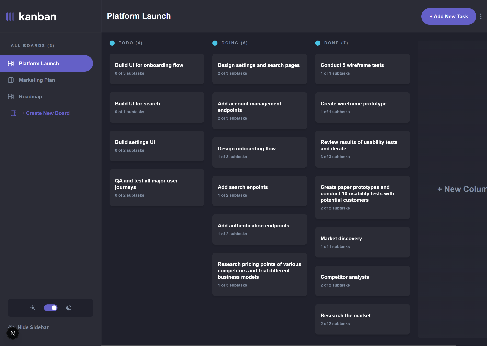
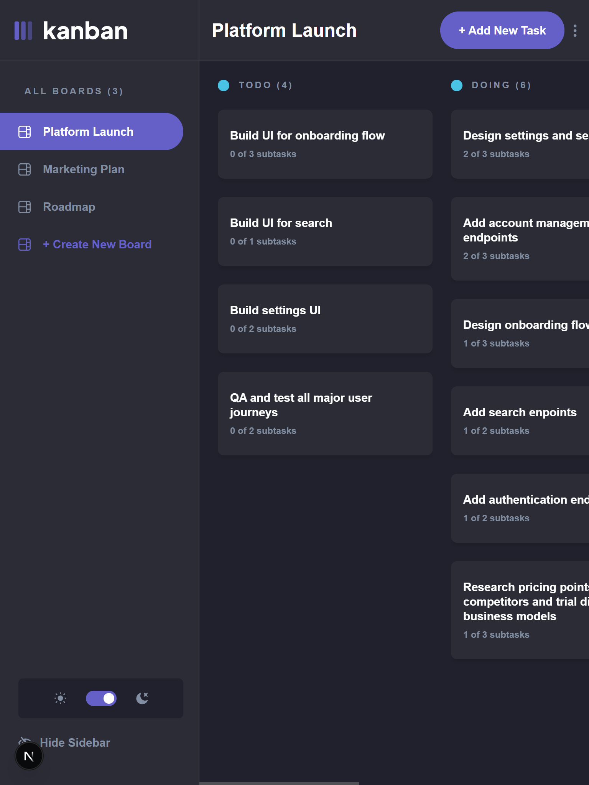
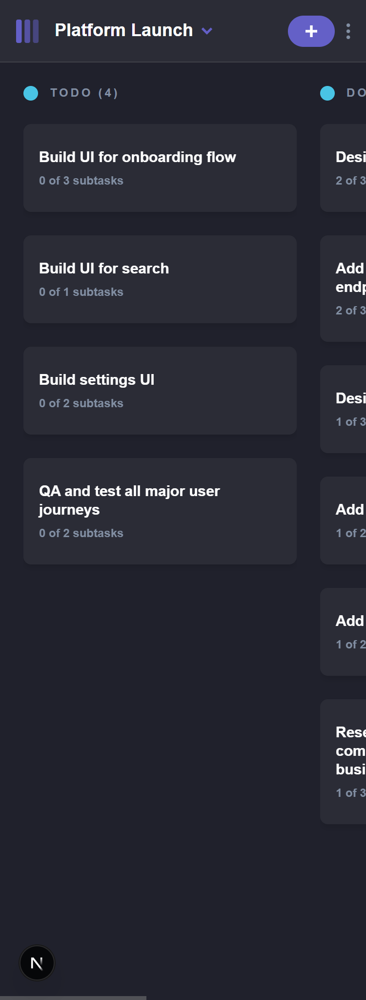

# Frontend Mentor - Kanban task management web app solution

This is a solution to the [Kanban task management web app challenge on Frontend Mentor](https://www.frontendmentor.io/challenges/kanban-task-management-web-app-wgQLt-HlbB).

## 🔎 Table of contents

- [Overview](#overview)
  - [The challenge](#the-challenge)
  - [Screenshot](#screenshot)
  - [Links](#links)
- [My process](#my-process)
  - [Built with](#built-with)
  - [What I learned](#what-i-learned)
  - [Continued development](#continued-development)
- [Author](#author)

## Overview

### The challenge

Users should be able to:

- View the optimal layout for the app depending on their device's screen size
- See hover states for all interactive elements on the page
- Create, read, update, and delete boards and tasks
- Receive form validations when trying to create/edit boards and tasks
- Mark subtasks as complete and move tasks between columns
- Hide/show the board sidebar
- Toggle the theme between light/dark modes
- Allow users to drag and drop tasks to change their status and re-order them in a column

### Screenshot

### Links

- Solution URL: [Add solution URL here](https://your-solution-url.com)
- Live Site URL: [Add live site URL here](https://your-live-site-url.com)

## My process

## 🛠️ Built with

### Core Tech Stack

- **Next.js**: Chosen for excelente SEO and seamless user experience.
- **Typescript**: Chosen for robust type-safety.
- **Tailwind CSS**: Used for highly maintainable and responsive UI design.

### Backend & Infrastructure

- **Supabase**: chosen as the main BaaS (Backend as a Service) for its robust **Authentication** system and seamless **Frontend Integration**.
  - **Auth**: implemented secure user sign-up and login flows with Row Level Security (RLS).
  - **Database**: PostgreSQL-powered real-time storage for boards, columns, and tasks.
  - **Integration**: used the Supabase JS SDK for efficient, type-safe data fetching.

### State Management & Validation

- **Zustand**: used for lightweight and scalable global client-state management.
- **TanStack Query (React Query)**: implemented to handle seamless data synchronization, caching and optimistic updates.
- **Zod**: utilized for schema validation and static type inference, ensuring that all data from API responses to user inputs sctrictly adheres to expected structures.

### Quality & Engineering

- **Conventional Commits**: strict adherence to standarized commit messages to ensure a clean and readable changelog.
- **Git Branching Strategy**: implementation of a `main`/`develop` workflow to maintain a stable production reawdy environment while integrating new features.
- **Unit Testing**:
  - **Vitest**: for fast, reliable unit testing following the AAA Principle.

### CI/CD Pipeline

- **GitHub Actions**: Automated workflows for continuous integration, running tests for every push and pull request.
- **Netlify**: Continuous deployment platform that serves the production-ready build automatically after successfull CI checks.

### 🏫 What I learned

#### Unit and integration tests with vitest and testing-library

- Configure vitest and testing library.
- AAA Pattern for tests (Arrange Act Assert).
- CI (Continuous Integration) with github actions.

### 🧑‍💻 Continued development

- I want to document and implement agile methologies on future projects.

## 👨 Author

- Frontend Mentor - [@JEWebDev](https://www.frontendmentor.io/profile/JEWebDev?tab=solutions)
